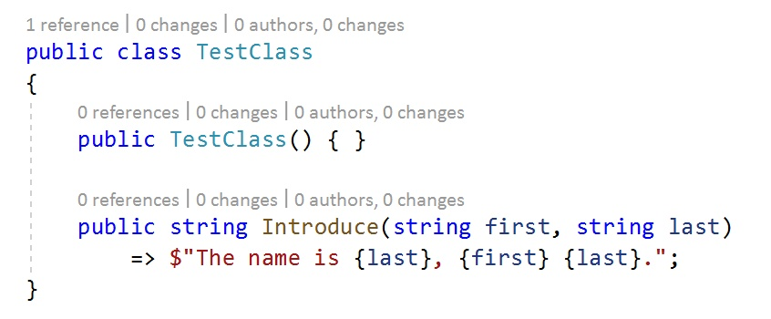
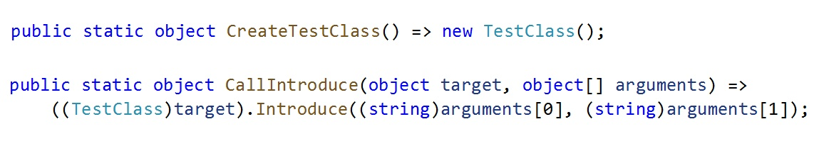
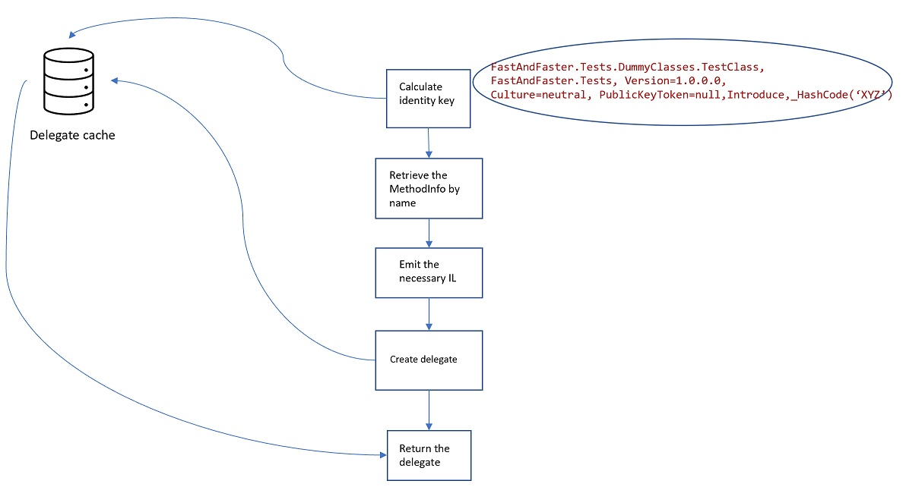
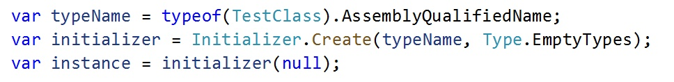
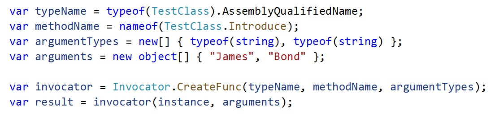
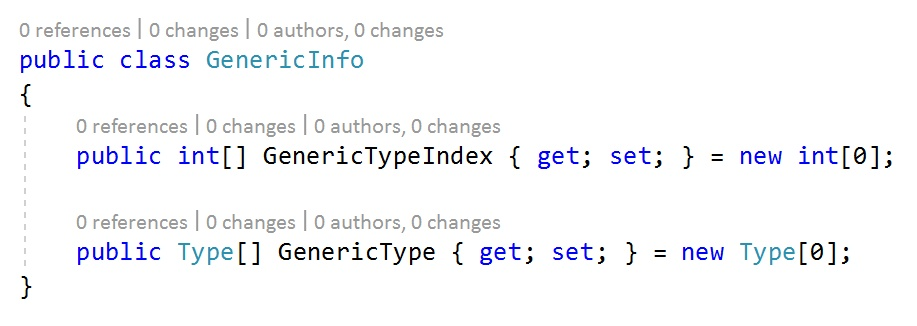
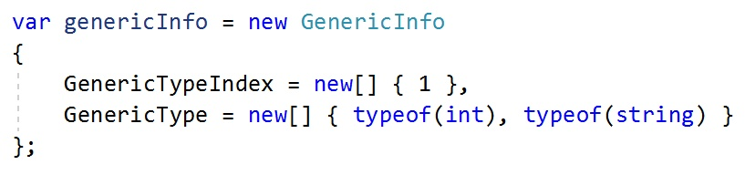
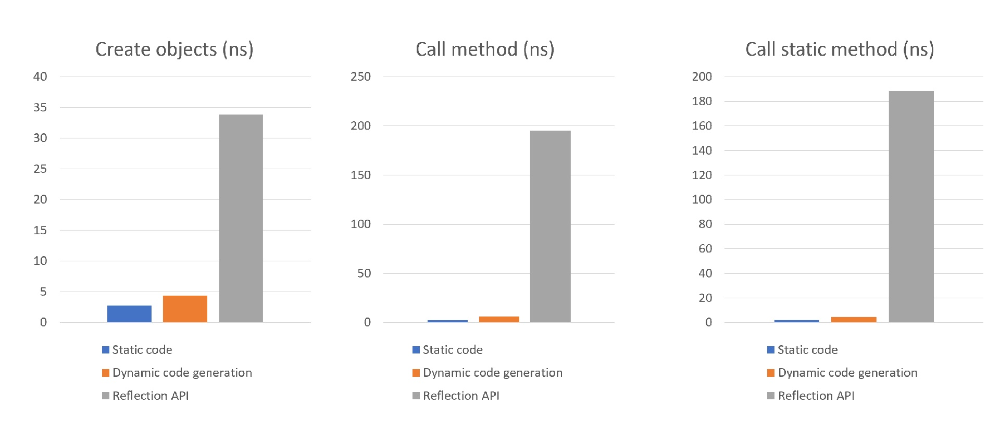

# Overview

C# .NET is mostly a static language. While it's possible to use the Reflection API to create objects and call their methods at runtime, this method is relatively slow. One way to speed up this process is to use dynamic code generator, which I wrote about in one of my blog posts: https://duongnt.com/dynamic-code-generation/

This library is an implementation of that.

## Use dynamic code generator to simulate static code

Let's say we have this very simple class.

We can write the following methods to create an object and call the Introduce method. Note that all arguments and return values are cast to `object` type. This is to make sure that the interface of our library is generic enough to handle all method signatures. You might notice that it is the same approach that the ReflectionAPI uses.

Given a class name, method name, and the list of parameter types, our goal is to use dynamic code generator to create delegates that are functionally identical to the methods above. If we use the same IL code, the performance of those delegates should be comparable to static code. They can then be used to replace the ReflectionAPI.

## The flow to create a delegate

The steps are below.
- Use the provided class name, method name, and the list of parameter types to retrieve the corresponding `MethodInfo` (or `ConstructorInfo` if we are trying to call a constructor).
- Emit the necessary IL code to load arguments into the stack, execute the method, and return the result (if any).
- Wrap everything into a delegate.

Moreover, because it is likely that we would want to repeatedly call the same method with different arguments, it makes sense to store the created delegates in a cache. The cache key is crafted from the class name, the method name, and the list of method parameters (generic ones included). By default, each cache entry has a sliding expiration time of 12 hours. But this is configurable.

## Non-generic code sample

Below is the code to create objects of type `TestClass`. Note that for a parameterless constructor/method, we can explicitly use `Type.EmptyType` as parameter types, or we can omit it altogether.

Then we can call the `Introduce` method on the created object.

To call a method that returns void, we simply switch from `Invocator.CreateFunc` to `Invocator.CreateAction`.

## Generic code sample

To call a generic method, we need to provide a list of concrete types, as well as specify which method parameters are generic. This information is provided by the `GenericInfo` type.

Let's say we want to call a method with this signature: `public void Method<T1, T2>(string s, T2 input)`.

We can see that it has two generic types, `T1` and `T2`. Moreover, its second parameter (index 1) is a generic parameter. To call it with `T1 == int` and `T2 == string`, we create this `GenericInfo` object and pass it to the `CreateFunc` method.

For non-generic methods, `GenericInfo` can be omitted.

## Benchmark

This is the comparison between static code, this library, and the ReflectionAPI.

In all cases, the performance of our library is much closer to static C# code than to the reflection API.

## Limitations

By design, this library can only call public constructors and methods. This is because I believe there is a good reason when a method is set to private. And violating this encapsulation can do more harm than good.

Having said that, it is not too complicated to enable calling non-public methods. The only step we need to modify is where we retrieve the MethodInfo. By passing the "BindingFlags.NonPublic" flag to "GetMethod", we can get the MethodInfo of a non-public method. Then we can continue to emit the IL code and create the delegate like normal.
